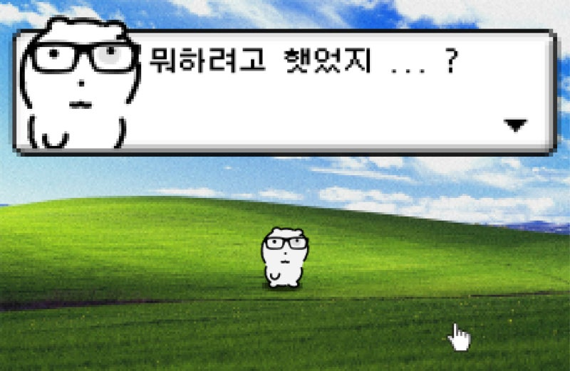

# 📌 L01: OpenCV 과제 

## 📝 과제 내용
1. **이미지 불러오기 및 그레이스케일 변환**
2. **웹캠 영상에서 에지 검출**
3. **마우스로 ROI(관심영역) 선택 및 저장**

## 결과 이미지
| 원본 이미지 | 그레이스케일 변환 및 에지 검출 | ROI 저장 |
|-------------|----------------|---------|
|  |  |  |
