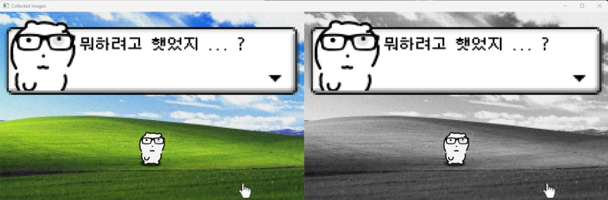
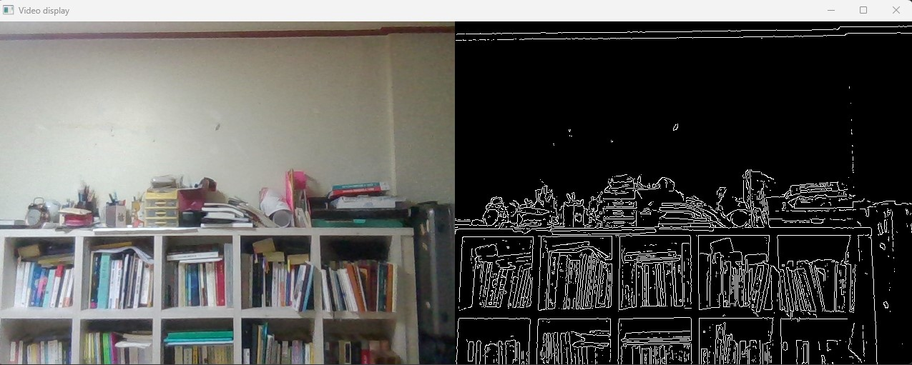
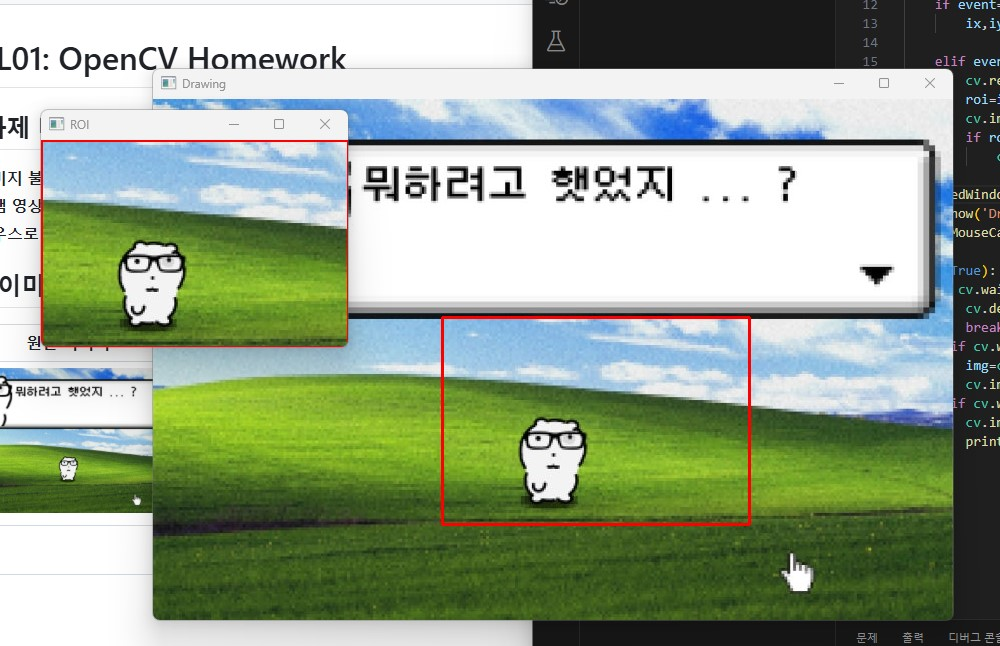

# 📌 L01: OpenCV Homework

## 📝 과제 내용
1. **이미지 불러오기 및 그레이스케일 변환**
   - OpenCV를 사용하여 이미지를 불러오고 화면에 출력
   - 원본 이미지와 그레이스케일로 변환된 이미지를 나란히 표시
2. **웹캠 영상에서 에지 검출**
   - 웹캠을 사용하여 실시간 비디오스트림을 가져옴
   - 각 프레임에서 Canny Edge Detection을 적용하여 에지를 검출하고 원본영상과 함께 출력
3. **마우스로 ROI(관심영역) 선택 및 저장**
   - 이미지를 불러오고 사용자가 마우스로 클릭하고 드래그하여 관심영역(ROI)을 선택
   - 선택한 영역만 따로 저장

## 결과 이미지
| 그레이스케일 변환 | 에지 검출 | ROI 저장 |
|-------------|----------------|---------|
|  |  |  |
