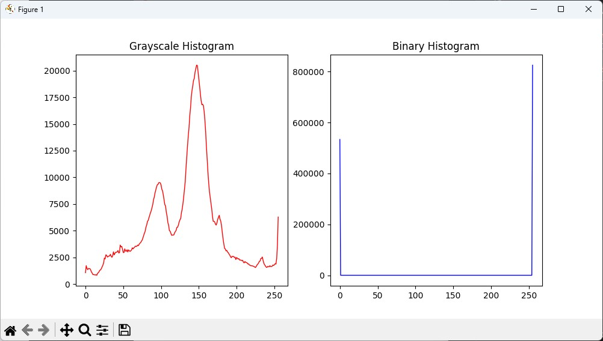
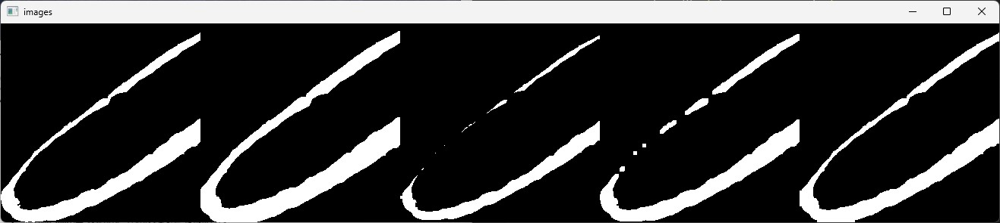
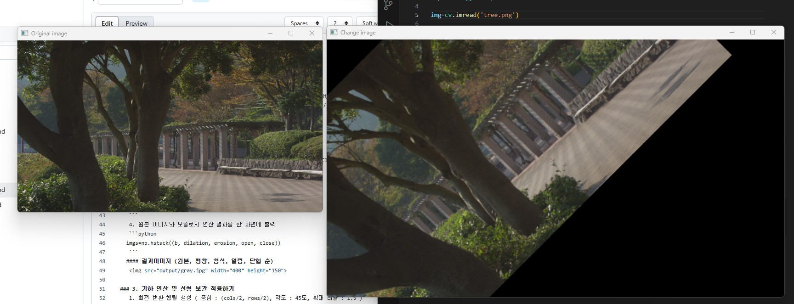

# 📌 L04: Vision Processing Basic Homework

## 📝 과제 내용

### 1. 이진화 및 히스토그램 구하기
   1. OpenCV를 사용하여 이미지를 불러옴
   ```python
  img=cv.imread('L04\img\soccer.jpg')
   ```
   2. 그레이스케일 변환
   ```python
  gray = cv.cvtColor(img, cv.COLOR_BGR2GRAY)
   ```
   3. 특정 임계값을 설정하여 이진화
   ```python
  t,bin_img=cv.threshold(gray,127,255,cv.THRESH_BINARY)
   ```
   4. 그레이스케일과 이진화된 이미지의 히스토그램을 계산하고 시각화
   ```python
   h=cv.calcHist([bin_img],[0],None,[256],[0,256]) 
   g=cv.calcHist([gray],[0],None,[256],[0,256]) 
   plt.figure(figsize=(10,5))
   plt.subplot(1,2,1)
   plt.plot(g,color='r',linewidth=1)
   plt.title("Grayscale Histogram")
   plt.subplot(1,2,2)
   plt.plot(h,color='b',linewidth=1)
   plt.title("Binary Histogram")
   plt.show()
   ```
  #### 결과이미지
   
     
### 2. 모폴로지 연산 적용하기
   1. 이미지 이진화 및 일부 추출
   ```python
  t,bin_img=cv.threshold(img[:,:,3],0,255,cv.THRESH_BINARY+cv.THRESH_OTSU)
  b=bin_img[bin_img.shape[0]//2:bin_img.shape[0],0:bin_img.shape[0]//2+1]
   ```
   2. 사각형 커널(5x5) 정의 
   ```python
  k = cv.getStructuringElement(cv.MORPH_RECT,(5,5))
   ```
   3. 모폴로지 연산 (팽창(Dilation), 침식(Erosion), 열림(Open), 닫힘(Close))
   ```python
  dilation = cv.morphologyEx(b, cv.MORPH_DILATE, k)
  erosion = cv.morphologyEx(b, cv.MORPH_ERODE, k)
  open = cv.morphologyEx(b, cv.MORPH_OPEN, k)
  close = cv.morphologyEx(b, cv.MORPH_CLOSE, k)
   ```
   4. 원본 이미지와 모폴로지 연산 결과를 한 화면에 출력
   ```python
  imgs=np.hstack((b, dilation, erosion, open, close))
   ```
  #### 결과이미지 (원본, 팽창, 침식, 열림, 닫힘 순)
   
   
### 3. 기하 연산 및 선형 보간 적용하기
   1. 회전 변환 행렬 생성 ( 중심 : (cols/2, rows/2), 각도 : 45도, 확대 비율 : 1.5 )
   ```python
  rows, cols = img.shape[:2]
  center = (cols / 2, rows / 2)
  matrix = cv.getRotationMatrix2D(center, 45, 1.5)
   ```
   2. 이미지 회전 및 크기 변경, 선형 보간 적용
   ```python
  change = cv.warpAffine(img, matrix, (int(cols*1.5),int(rows*1.5)), flags=cv.INTER_LINEAR)
   ```
   3. 원본 이미지와 회전 및 확대된 이미지를 한 화면에 비교
   ```python
   cv.imshow('Original image', img)
   cv.imshow('Change image', change)
   ```
   
