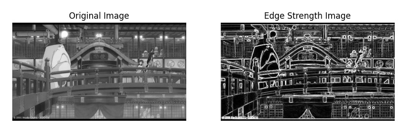
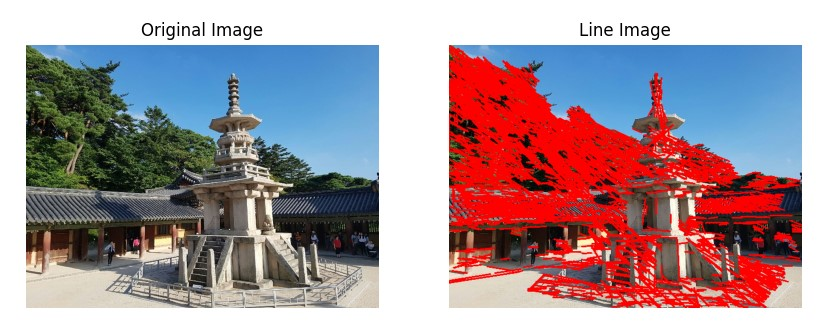
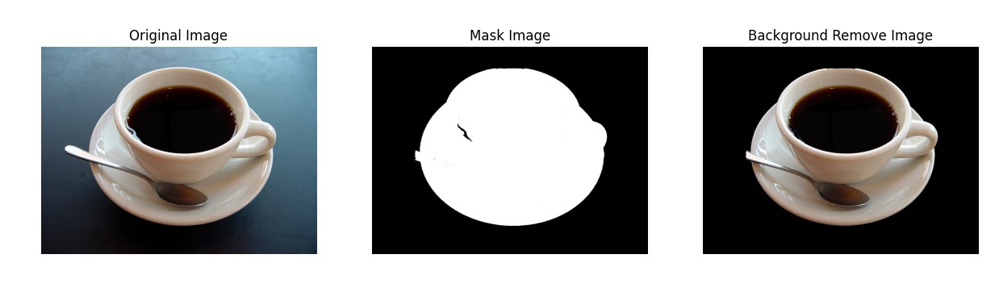

# 📌 L05: Edge and Region Homework

## 📝 과제 내용

### 1. 소벨 에지 검출 및 결과 시각화
   1. OpenCV를 사용하여 이미지를 불러옴
   ```python
  img=cv.imread('L05\img\edgeDetectionImage.jpg')
   ```
   2. 그레이스케일 변환
   ```python
  gray = cv.cvtColor(img, cv.COLOR_BGR2GRAY)
   ```
   3. 소벨(Sobel) 필터를 사용하여 X축과 Y축 방향의 에지를 검출
   ```python
  grad_x=cv.Sobel(gray,cv.CV_64F,1,0,ksize=3)
  grad_y=cv.Sobel(gray,cv.CV_64F,0,1,ksize=3)
   ```
   4. 검출된 에지 강도(edge strength) 이미지를 시각화
   ```python
  magnitude=cv.magnitude(grad_x,grad_y)
  edge_strength=cv.convertScaleAbs(magnitude)
   ```
  #### 결과이미지
   
     
### 2. 캐니 에지 및 허프 변환을 이용한 직선 검출
   1. 캐니(Canny) 에지 검출을 사용하여 에지 맵을 생성
   ```python
  edge=cv.Canny(img,100,200)
   ```
   2. 허프 변환(Hough Transform)을 사용하여 이미지에서 직선을 검출
   - rho=1, theta=np.pi/180=1, threshold=80, minLineLength=15, maxLineGap=5
   ```python
  lines=cv.HoughLinesP(edge, 1, np.pi/180, 80, minLineLength=15, maxLineGap=5)
   ```
   3. 검출된 직선을 원본 이미지에 빨간색(0,0,255)으로 표시
   ```python
  line_img=img.copy()
  if lines is not None:
      for line in lines:
          x1, y1, x2, y2 = line[0]
          cv.line(line_img, (x1, y1), (x2, y2), (0,0,255), 2)
   ```
   
  #### 결과이미지 
   
   
### 3. GrabCut을 이용한 대화식 영역 분할 및 객체 추출
   1. GrabCut parameter 설정 및 객체 추출
   ```python
  mask = np.zeros(img.shape[:2], np.uint8)
  bgdModel = np.zeros((1, 65), np.float64)
  fgdModel = np.zeros((1, 65), np.float64)
  mode = cv.GC_INIT_WITH_RECT
  iterCount = 1
  rc = (200, 100, 920, 730)
  
   ```
   2. Grapcut 알고리즘 수행 
   ```python
  cv.grabCut(img, mask, rc, bgdModel, fgdModel, iterCount, mode)
   ```
   3. 마스크를 사용해 원본 이미지에서 배경을 제거
   - cv.GC_BGD(0), cv.GC_PR_BGD(2) 사용
   ```python
  mask2 = np.where((mask == cv.GC_BGD) | (mask == cv.GC_PR_BGD),0,1).astype('uint8')
  dst = img * mask2[:, :, np.newaxis]
   ```
   
